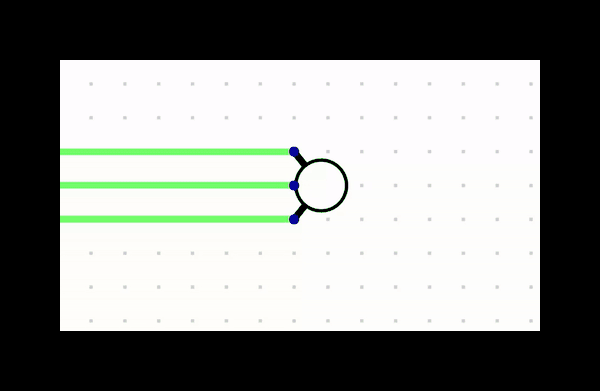

# Lab-1

### Setup Instructions
1. Enter the [Digital](Digital) folder.
2. Execute `bash Digital.sh` to start the application.
3. Please go through the tutorial triggered to learn how to build a circuit.

+ For each component, hover over the pins to know the usage
+ For a component, right clicking allows you to change its parameters

## Q1 (2 points)
1. Create a combinatorial circuit to map the output of the 2-bit counter to the control pins of the 7-edge display
    - Replace the 2bitdisplay_component with your combinatorial circuit
    - Construct the other components i.e, input, clock, counter and display as shown in the image
2. The final file must contain the full circuit
3. You are allowed to use the counter, splitter and 7-edge display components available in the tool
4. Use only the NOT gate and 2-input AND,OR,NAND,NOR,XOR gates
5. Save the final file as `q1.dig`

Note: Display must start with 0. Clock must be set to real time with frequency of 1Hz.

### Grading Policy
- 2 points for a complete working solution
- 0 points for the rest

## Q2 (3 points)

1. Create a counter whose output varies as follows: 1->2->1->3->1->4 and repeat
2. You are allowed to use at most 3 D-Flip flops and NOT gate(s) along with any number of 2-input logic gates
3. Connect this counter with the display made for the previous problem
4. Save the final file as `q2.dig`

Note: Display must start with 1, the proceed to 2. Clock must be set to real time with frequency of 1Hz.

### Grading Policy
- 3 points for a complete working solution
- 0 points for the rest

## Q3 (5 points)
1. Implement a RGB light switching system which follows following sequence of colors:
    1. White (R+G+B)
    2. Blue (B)
    3. Sky Blue/Cyan (G+B)
    4. Red (R)
    5. Purple/Magenta (R+B)
    6. Yellow (R+G)
    7. Green (G)
2. Above sequence should be followed on repeat
3. You are allowed to use 3 D-flip flops along with a single NOT gate and any 3 2-input logic gates and RGB-LED component (see IO section)
4. Save the final file as `q3.dig`

You don't even need a NOT gate :)

Note: RGB-LED must start with white. Clock must be set to real time with frequency of 1Hz.

### Grading Policy
- Full 5 points for <4 2-input logic gates and atmost 1 NOT gate used
- 3 points for any working solution
- 0 for any other case

## Submission Instructions
Submit the files `q1.dig`, `q2.dig`, `q3.dig` on [BodhiTree](https://flamingo.bodhi.cse.iitb.ac.in/) in **Subjective Submissions** tab

Note: Incorrect submission will lead to 0 marks

### Deadline : 23:59, August 27, 2023

For late submission, 10% penalty will be levied per day
